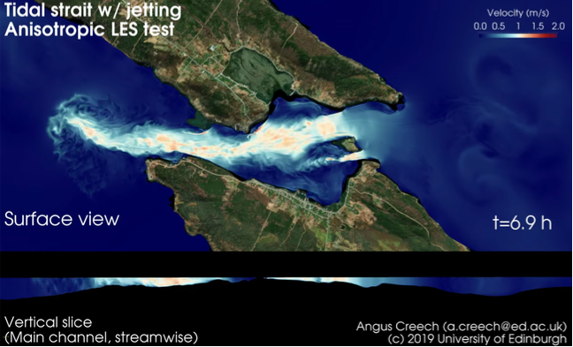

Using CoastED   (a computational fluid dynamics software package tailored and optimised for modelling coastal currents 
at the local scale, ie. 10-100 km, whilst also resolving engineering scales, ie. smaller than 1 m), simulations modelling 
tidal currents at sites considered viable for tidal energy have been undertaken on Cirrus. Tidal currents at viable tidal 
energy sites are generally extremely strong, with peak flow speeds of 2-3 m/s. Such flow is extremely turbulent, often 
with Reynolds numbers of 10,000,000 or higher. This requires a specialised version of Large Eddy Simulation turbulence 
algorithm, which deals with highly anisotropic, non-hydrostatic flow, and as a result is capable of producing an 
unparalleled level of detail and information on the fluid dynamics being studied. These simulations allow a detailed 
understanding of the potential energy in the modelled tidal sites, the best positions for installing turbines for optimal 
energy extraction, simulation of engineering stresses on turbine structures, and impacts of placement on seabeds.

## Acknowledgement

This work used the Cirrus UK National Tier-2 HPC Service at EPCC funded by the University of Edinburgh and EPSRC (EP/P020267/1). (http://www.cirrus.ac.uk)  

## Contact Us

If you are interested in creating a case study highlighting your work on Cirrus then please do not hesitate to
[contact the support team](../support/).
